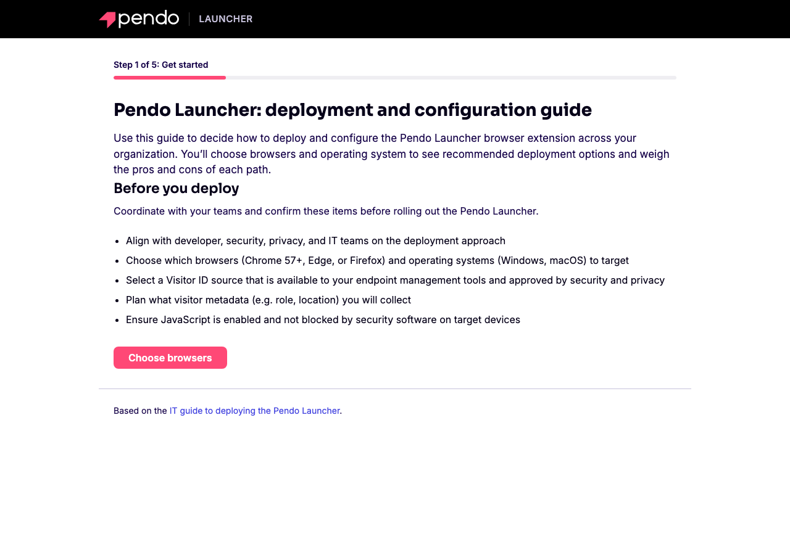
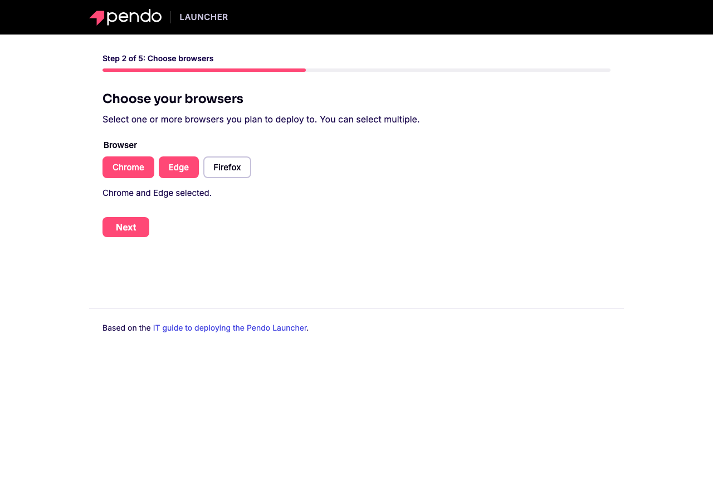
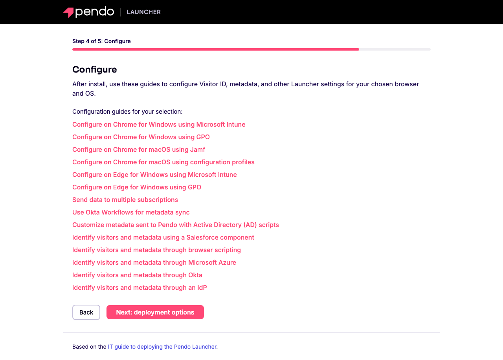
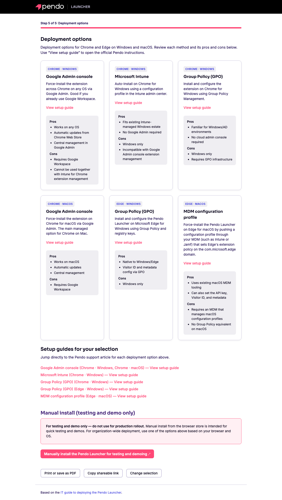
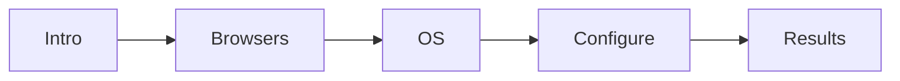

<div align="center">

# Pendo Launcher Deployment Decision App

Help IT and project managers choose the right **Pendo Launcher** deployment path by browser and operating system.

[Live demo](https://jbambury94.github.io/Pendo-Launcher-Assistant/) &nbsp;·&nbsp; [Pendo IT deployment guide](https://support.pendo.io/hc/en-us/articles/21164568842395-IT-guide-to-deploying-the-Pendo-Launcher) &nbsp;·&nbsp; [Licence](#licence-and-intellectual-property)

</div>

A static, single-page wizard that walks you through deploying and configuring the Pendo Launcher browser extension. Pick your browsers and operating systems, and the app shows only the relevant deployment methods, each with pros, cons, and a link to the official Pendo support article.

> **Proprietary** — you may view and run this app unmodified to evaluate and guide a Pendo Launcher rollout. See [Licence and intellectual property](#licence-and-intellectual-property) for the full terms.

## Screenshots

<table>
  <tr>
    <td width="50%"><br><sub><b>Step 1</b> — Pre-deploy checklist</sub></td>
    <td width="50%"><br><sub><b>Step 2</b> — Choose browsers and OS</sub></td>
  </tr>
  <tr>
    <td width="50%"><br><sub><b>Step 4</b> — Configuration guides</sub></td>
    <td width="50%"><br><sub><b>Step 5</b> — Deployment options</sub></td>
  </tr>
</table>

## Features

- **Guided wizard** — Five steps (intro, browsers, OS, configure, results) with a "Step X of 5" label and progress bar, so there is only ever one decision on screen.
- **Filtered recommendations** — Select one or more browsers (Chrome, Edge, Firefox) and operating systems (Windows, macOS) to see only the deployment methods that apply.
- **Configuration guides** — A dedicated step lists Visitor ID, metadata, and other configuration articles for your selection, plus global "Other configurations" such as Okta, Salesforce, Microsoft Azure, Active Directory scripts, and multi-subscription setups.
- **Option cards** — Each deployment method is a card with a short description, pros and cons shown by default, and a "View setup guide" link to the official Pendo support article.
- **Shareable, saved selections** — Your choices are encoded in the URL and saved to the browser, so results can be bookmarked, shared by link, or restored on your next visit.
- **Copy shareable link** — One click copies the URL for your selection. When the app is opened from a local file, the copied link points at the hosted version so it still works for others.
- **Print or save as PDF** — A print-friendly layout turns the deployment summary into a clean PDF.
- **Logo home** — The header logo returns you to the start without clearing your selection.
- **Browser navigation** — Back, forward, and manual address-bar changes restore the matching step and selection.
- **Manual install warning** — The testing-only manual install path is clearly labelled and separated from production methods.
- **Accessible by design** — Toggle buttons expose pressed state, hints use live regions, the progress bar carries the right roles, and focus moves to each step heading on navigation.

> **Edge on macOS:** there is no standalone Pendo article for this path, so its "View setup guide" link points at the general IT deployment guide instead.

## How it works



1. **Intro** — Review the pre-deploy checklist and align with your dev, security, privacy, and IT teams.
2. **Browsers** — Choose one or more browsers to target.
3. **OS** — Choose one or more operating systems.
4. **Configure** — Open the configuration guides relevant to your selection.
5. **Results** — Compare deployment option cards, open setup guides, and print or share the summary.

## Share links and persistence

Your selection lives in the URL, so any result is a shareable link:

```
https://jbambury94.github.io/Pendo-Launcher-Assistant/?browsers=chrome,edge&os=windows,macos#results
```

| Mechanism | Purpose |
|-----------|---------|
| `?browsers=` | Comma-separated browsers: `chrome`, `edge`, `firefox` |
| `?os=` | Comma-separated operating systems: `windows`, `macos` |
| `#intro` … `#results` | The wizard step to open |
| `localStorage` (`pla-selection`) | Restores your selection on a return visit when the URL has no query |

If the browser blocks the Clipboard API, the "Copy shareable link" button falls back to a text field you can copy by hand.

## Run locally

There is no build step or dependency to install. Run the app unmodified to guide your deployment decisions:

1. **From the filesystem** — Open `index.html` directly in your browser.
2. **With a local server (recommended)** — From the project root:

```bash
python3 -m http.server 8000
```

   Then open `http://localhost:8000`. A local server is the best way to test share links and clipboard behaviour.

## Project structure

```
.
├── index.html        # Step-based layout: intro, browsers, OS, configure, results
├── styles.css        # Pendo-themed layout, components, and print styles
├── script.js         # Step flow, options matrix, rendering, and interactivity
├── assets/           # Pendo logo lockups (Brand Assets — see Licence)
├── docs/
│   └── screenshots/  # Images used in this README
├── favicon.svg       # Pendo chevron icon (Brand Asset)
├── README.md
├── LICENSE
└── .gitignore
```

The header uses the official Pendo horizontal lockup from the [Pendo brand guide](https://www.pendo.io/brand-guide/logo/): the primary light variant (white wordmark, Pank chevron) on the dark header. These marks are used in context within this app only; independent reuse is not permitted (see [Licence](#licence-and-intellectual-property)).

## Maintaining deployment data

All deployment copy and links live in data objects at the top of [script.js](script.js), so updates do not require touching the rendering logic:

| Constant | What it controls |
|----------|------------------|
| `SUPPORT_URLS` | The Pendo support article URL for each deployment option |
| `OPTIONS_MATRIX` | Deployment cards — title, description, pros, and cons, keyed by `"browser\|os"` |
| `CONFIG_OPTIONS` | Per-browser/OS configuration article links |
| `CONFIG_OPTIONS_ADDITIONAL` | Global configuration articles shown for every selection |

When a Pendo article changes:

1. Confirm the support article URL still resolves.
2. Update the relevant entry in [script.js](script.js).
3. If a cached copy might be served, bump the version query on the script and style tags in [index.html](index.html) (for example `script.js?v=2` to `script.js?v=3`).
4. Test the affected browser and OS combination in the wizard.

## Contributing

This is a proprietary project, not open source. Contributions are accepted from maintainers and collaborators with authorisation from the copyright holders.

Acceptable changes include keeping Pendo article links accurate, refining deployment copy and pros/cons, improving accessibility, and polishing the UI. When contributing, please:

- Do not redistribute, sublicense, or create derivative works outside this repository without written permission.
- Do not extract or reuse the Brand Assets (`assets/`, `favicon.svg`, the Pendo colour palette, or trade dress) separately from the unmodified app.
- Do not use Pendo trademarks in any way that implies sponsorship or endorsement, and do not remove or alter copyright or trademark notices.
- Use British English in user-facing copy and comments, and never commit secrets or customer data.
- Test share links, the print layout, and keyboard navigation before opening a pull request.

## Licence and intellectual property

This repository is covered by a proprietary licence. © 2025 Pendo, Inc. and John Bambury. All rights reserved.

| Topic | Summary |
|-------|---------|
| **Ownership** | The application code is owned by its authors. The Brand Assets are owned by Pendo, Inc. |
| **Permitted use** | View and run the application **unmodified**, solely to evaluate and guide deployment of the Pendo Launcher. |
| **Not permitted** | Copying, modifying, distributing, sublicensing, selling, or creating derivative works without written permission from the respective owner. |
| **Brand Assets** | Files in `assets/`, `favicon.svg`, the Pendo name, wordmark, and chevron, and the Pendo colour palette and trade dress may not be extracted or reused independently. |
| **Trademarks** | Pendo and related marks are trademarks of Pendo, Inc. No trademark licence is granted; any external use requires written permission and must follow the [brand guide](https://www.pendo.io/brand-guide/logo/). |
| **Warranty** | The work is provided "as is", without warranty of any kind. |

Full terms — see [LICENSE](LICENSE).

## References

- [IT guide to deploying the Pendo Launcher](https://support.pendo.io/hc/en-us/articles/21164568842395-IT-guide-to-deploying-the-Pendo-Launcher) — Primary source for the structure and copy.
- [Manually install the Pendo Launcher for testing and demoing](https://support.pendo.io/hc/en-us/articles/21165109646619-Manually-install-the-Pendo-Launcher-for-testing-and-demoing) — Linked in the app for testing-only use.
